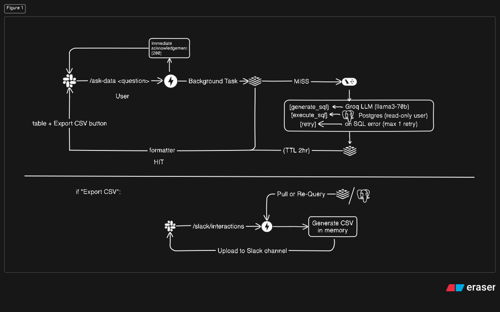

# slackAI-data-bot-mvp
A minimal slack app that turns a natural language question into SQL.

---

## Demo

<video src="slackAIbot_mvp_demo.mp4" controls="controls" style="max-width: 100%;">
</video>

> `/ask-data show revenue by region for 2025-09-01`
The bot replies instantly with a formatted table and an **Export CSV** button.

---

## Architecture



---

## Project Structure

```
slack-data-bot/
├── docker/
│   ├── Dockerfile
│   ├── docker-compose.yml   # Postgres + Redis + App
│   └── init.sql             # Seed data
├── src/
│   ├── api/
│   │   ├── main.py          # FastAPI app factory
│   │   └── routes.py        # /slack/command, /slack/interact
│   ├── schemas/
│   │   └── slack.py         # SlashCommandPayload, InteractivityPayload
│   ├── services/
│   │   ├── llm_service.py   # LangGraph agent (generate → execute → retry)
│   │   ├── cache_service.py # Redis get/set with TTL
│   │   └── slack_service.py # post_message, upload_csv, post_ack
│   ├── utils/
│   │   ├── prompts.py       # System prompt + user prompt builder
│   │   ├── db.py            # SQLAlchemy engine + execute_query
│   │   ├── formatter.py     # Slack Block Kit builder
│   │   └── csv_generator.py    # rows → CSV bytes
│   └── core/
│       ├── config.py        # pydantic-settings + lru_cache
│       └── logging.py       # Structured stdout logger
├── tests/
│   └── test_pipeline.py
├── .env
├── .env.example
├── .python-version
├── pyproject.toml
├── .gitignore
├── uv.lock
├── LICENSE
├── SYSTEM_DESIGN.md
└── README.md
```

---

## Quickstart

### 1. Clone and configure

```bash
git clone https://github.com/yourname/slack-data-bot
cd slack-data-bot
cp .env.example .env
# Fill in SLACK_BOT_TOKEN, SLACK_SIGNING_SECRET, GROQ_API_KEY
```

### 2. Start infrastructure + app

```bash
docker compose -f docker/docker-compose.yml up --build
```

This starts Postgres (with schema + seed data), Redis, and the FastAPI app on port 8000.

### 3. Expose to Slack (local dev)

```bash
ngrok http 8000
```

Copy the `https://xxxx.ngrok.io` URL.

### 4. Configure Slack App

1. Go to [api.slack.com/apps](https://api.slack.com/apps) → Create New App
2. **Slash Commands** → Create `/ask-data` → Request URL: `https://xxxx.ngrok.io/slack/command`
3. **Interactivity** → Enable → Request URL: `https://xxxx.ngrok.io/slack/interact`
4. **OAuth & Permissions** → Add scopes: `chat:write`, `files:write`, `commands`, `im:write`
5. Install to workspace → copy Bot Token into `.env`
6. Copy Signing Secret from Basic Information → `.env`
7. From the workspace, get Channel_ID → `.env`

### 5. Try it

```
/ask-data show total revenue by region
/ask-data which category had the most orders on 2025-09-02
/ask-data compare revenue between north and south
```

---

## Design Decisions

**Why LangGraph over a plain LangChain chain?**
LangGraph lets us model the generate→execute→retry flow as an explicit state machine. The retry node feeds the SQL error message back to the LLM, which corrects the query without any manual string wrangling. This is cleaner than a try/except wrapper and trivially extensible (e.g. adding a multi-turn conversational node later).

**Why cache by question, not by generated SQL?**
The same question always maps to the same intent. Caching the normalized question string means a cache hit skips both the LLM call (latency + cost) and the DB query. Cache key = -MD5 of lowercase-stripped question, stored in Redis with a 2hr TTL.

**Why immediate ACK + BackgroundTask?**
Slack kills slash commands that don't respond within 3 seconds. FastAPI's `BackgroundTasks` lets us return HTTP 200 immediately, then do the real work (LLM + DB) asynchronously and post back via the Slack API. No job queue needed for this scale.

**Why a read-only Postgres user?**
The LLM could theoretically generate `DROP TABLE` or `DELETE` if the prompt leaks. A read-only DB user (`GRANT SELECT` only) is infrastructure-level protection that costs nothing and requires no application-level parsing.

---

## What I'd Add in Production

- **Input validation**: regex/LLM check to reject obviously non-data questions before hitting Groq
- **Multi-table support**: dynamic schema introspection via `information_schema` instead of a hardcoded prompt
- **Rate limiting**: per-user Slack ID rate limit (Redis counter) to prevent abuse
- **Audit log**: Postgres table logging `(user_id, question, sql, latency, cache_hit, timestamp)`
- **Horizontal scaling**: the app is stateless; add a load balancer + multiple replicas
- **CI/CD**: GitHub Actions running pytest on every PR


---

## Tech Stack

| Layer | Technology |
|---|---|
| API | FastAPI + Uvicorn |
| Agent | LangGraph + LangChain |
| LLM | Groq (llama3-70b-8192) |
| Database | PostgreSQL 16 |
| Cache | Redis 7 |
| Slack SDK | slack-sdk 3.x |
| Config | pydantic-settings |
| Containers | Docker + Docker Compose |

---

## Acknowledgement

- Assignment - evvolv.ai
